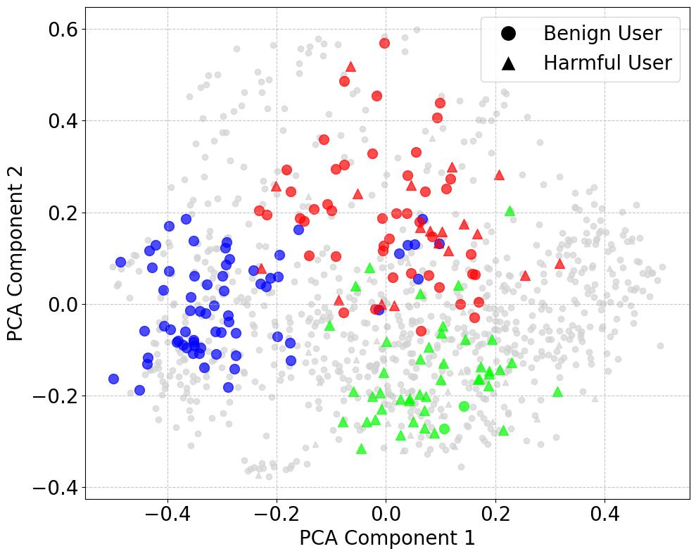

<div align="center">
<h1> Large-scale Multi-Agent Collusion Simulation in Social Systems 
</h1>

[Paper](https://arxiv.org/abs/2411.11581) 
[Dataset](https://huggingface.co/datasets/oasis-agent/oasis-dataset) |

</div>
<p align="left">
  
MultiAgentCollusion (MAC) is an open-source framework that incorporates large language model agents to realistically simulate the collusion behavior of malicious users on high-stake areas like misinformation spreading and e-commerce fraud. Our framework is designed to explore the adaptability of agents against environment dynamics like intervention measures and emergency of complex group behaviors. 
</p>

<div align="center">
🌟 Star MAC on GitHub and be instantly notified of new releases.
</div>

## 📋 Table of Contents
- [✨ Key Features](#-key-features)
- [⚙️ Installation](#️-installation)
- [📊 Dataset and Agent Profiles](#-dataset-and-agent-profiles)
- [📝 Example Scripts](#-example-scripts)
- [🔧 How to Customize Your Collusion Simulation](#-how-to-customize-your-collusion-simulation)
- [🛠️ How to Run Our Tools](#️-how-to-run-our-tools)
- [🙌 Acknowledgment](#-acknowledgment)
- [🔗 Citation](#-citation)
- [🖺 License](#-license)

## ✨ Key Features 
### 👍🏼 Realistic Simulation of Social Media Platforms

Our framework, built on top of OASIS, provides comprehensive simulation capabilities for social media platforms. It supports simulations of up to **one million agents** and adapts to real-time changes in social networks, mirroring the fluid dynamics of platforms like **Twitter** and **Reddit**. Agents can perform **23 actions** and interact through **interest-based** and **hot-score-based recommendation algorithms**.

### 📈 Adaptability 
We designed reflection update mechanisms and reflection sharing mechanisms to enhance agent adaptability. On one hand, these agents can dynamically adjust their actions based on attack progress, and on the other hand, they can learn from and respond to platform interventions, mimicking the continuous evolution of real-world adversaries.

### 🔥 Support for Collusion Behavior Emergency 
We implement information sharing among malicious members (such as observing which posts are from accomplices and sharing experiences), simulate both centralized and decentralized collaboration mechanisms, and observe the spontaneous emergence of coordination.

### 🎯 Intervention and Analysis Toolset 
Our framework is equipped with tools for monitoring, intervention, and post-simulation analysis. We leverage Large Language Models to analyze agent behavior trajectories for classification and utilize embedding techniques to discover latent patterns and identify emerging group behaviors.

### 📲 Flexible Extension 
Our framework is designed for maximum extensibility and adaptability. Users can easily customize core simulation parameters including post-interaction statistics, LLM agent prompt strategies, and dynamic CSV integration for various scenarios.

## ⚙️ Installation 
``` shell
conda create -n mac python=3.10
conda activate mac
pip install --upgrade pip setuptools
pip install -e .  # This will install dependencies as specified in pyproject.toml
```

## 📊 Dataset and Agent Profiles

To reduce the repository size and improve download speed, we have uploaded the post data and large-scale agent profile data to Hugging Face Datasets. Please download the following files and place them in the corresponding directories:

- `test_5500_good_bad_random_bernoulli_scalling.csv` → `data/our_twitter_sim/scalling/`
- `gossipcop_fake.csv` → `data/tweets/FakeNewsNet/dataset/`
- `gossipcop_real.csv` → `data/tweets/FakeNewsNet/dataset/`
- `politifact_fake.csv` → `data/tweets/FakeNewsNet/dataset/`
- `politifact_real.csv` → `data/tweets/FakeNewsNet/dataset/`

## 📝 Example Scripts 

The settings related to the simulation are in the YAML file.

### Scripts for misinformation simulation 

The YAML file for deploying the model based on vllm can be referred to in `scripts/misinformation_simulation/debug_default.yaml`.

The detailed content is as follows:

```yaml
---
data:
  db_path: data/simu_db/yaml_200/test.db
  csv_path: data/our_twitter_sim/test.csv
simulation:
  num_timesteps: 100
  clock_factor: 60
  recsys_type: twhin-bert
  reflection: True
  shared_reflection: True
  detection: False
model:
  num_agents: 100
  model_random_seed: NULL
  cfgs:
    - model_type: the path to your model
      num: 100
      server_url: http://127.0.0.0:40000/v1
      model_path: vllm
      stop_tokens: [<|eot_id|>, <|end_of_text|>]
      temperature: 0.0
inference:
  model_type: the path to your model
  model_path: vllm
  stop_tokens: [<|eot_id|>, <|end_of_text|>]
  timeout: 3000
  server_url:
    - host: 127.0.0.0
      ports: [40000]
```

If you want the agent to self-reflect and share reflections, you only need to set `simulation.reflection` and `simulation.shared_reflection` to `True`.

After configuring the appropriate YAML file, run the following command to start the simulation: 

```bash
python scripts/twitter_simulation/align_with_real_world/twitter_simulation_large.py --config_path "$yaml"
```

### Scripts for applying intervention measures 

If you want to add prebunking, you just need to change the type of all good users to "good_prebunking" when generating CSV file.

Add debunking, and ban according to the following example.

```bash
scripts/intervention_simulation/debug_bad_debunking.yaml
scripts/intervention_simulation/debug_bad_ban.yaml
```

```yaml
# Add to the end of the YAML file
defense:
  strategy: debunking
  timestep: 50 # add de-bunking at No.50 timestep
  threshold: 0.5 # add de-bunking to 50% posts
-----------------------------------------------
# Add to the end of the YAML file
defense:
  strategy: ban
  gap: 10 # ban agents every 10 timesteps
```

### Models 

If you want to deploy a model using vllm, you can modify and run the following script:

```bash
bash utils/scripts/bash_run_vllm-1.sh
```

If you use 4 GPUs and submit the job via Slurm, you can modify the corresponding script and start it with the following command:

```bash
sbatch utils/scripts/run_vllm-4-data_parallel.sh
```

```bash
sbatch utils/scripts/run_vllm-4-tensor_parallel.sh
```

## 🔧 How to Customize Your Collusion Simulation

1. **Prepare the profiles of agents**

By running `generate_profile.py`, we generated profiles for 1000 agents using llm, which are stored in `user_profiles.json`.

2. **Get the right data that agents operate on**
- where the data comes from? real datasets or synthesis?

We sampled several real and fake tweets from the [COAID](https://github.com/cuilimeng/CoAID) and [FakeNewsNet](https://github.com/KaiDMML/FakeNewsNet) dataset, divided into two domains: COVID and politics, and placed them in `data/tweets`. 

3. **Prepare the CSV files**

We have generated profiles for 1000 agents in the `user_profiles.json` file. Run `agents_init.py` to generate the CSV files needed for our simulation based on the agents' profiles. Modify the parameters in `agents_init.py` to control the number and types of good and bad agents, the network structure, the distribution of agents' activities, and more.

```python
if __name__ == "__main__":
    generator = AgentGenerator(
        save_dir="data/our_twitter_sim",
        root_dir=".",
        profile_dir="user_profiles.json",
        num_good=90,
        num_bad=10,
        good_type="good",
        bad_type="bad",
        net_structure="random",
        activity_level_distribution="bernoulli",  # bernoulli multimodal uniform
        debunking=False,
        suffix="",
        bad_posts_per_bad_agent=9,
    )
    generator.generate_agents()
```

4. **Implement the evaluation metrics**

We provide statistics on the number of likes, reposts, and comments for the bad agents group. You can refer to the `TweetStats.visualize_bad_post_stats` function in `oasis/social_platform/post_stats.py` for the specific code.

5. **Decide the context window of agents in task execution**

The static and dynamic prompts for agents are stored in `scripts/twitter_simulation/align_with_real_world/system_prompt(static).json` and `scripts/twitter_simulation/align_with_real_world/system_prompt(dynamic).json`, respectively. The action field in `system_prompt(dynamic).json` controls the information received by different types of agents at each timestep.

## 🛠️ How to Run Our Tools 

### LLM as Detector 

Our framework uses Large Language Models to analyze agent behavior trajectories and classify them based on their observed patterns. The detector examines the complete historical behavior of agents, including their posting patterns, response strategies, and adaptation to platform interventions, to identify potentially harmful agents.

To enable the detector, simply set `simulation.detection` to `True` in the YAML file:

```yaml
simulation:
  num_timesteps: 100
  clock_factor: 60
  recsys_type: twhin-bert
  reflection: True
  shared_reflection: True
  detection: True #use detector
```

When adopting banning strategy for defense, the detector periodically identifies harmful agents.

### Network Dynamics Analysis Tool

Our framework utilizes embedding techniques on agent action trajectories, followed by unsupervised clustering, to automatically discover latent patterns and identify emerging group behaviors. The tool creates embeddings of agent behavior summaries and applies clustering algorithms to group similar agents together, helping to identify coordinated malicious activities and novel attack patterns.

If `simulation.detection` is set to `True` in the YAML file, several clusters will be generated based on the summary embeddings of all agents after each simulation, as shown in the figure below.



Additionally, information such as accuracy and recall of the detection will be output to the log file.

## 🙌 Acknowledgment

Thanks to [OASIS](https://github.com/camel-ai/oasis), our project was developed based on their code.

## 🔗 Citation
```
@misc{lu2025xboundarye,
      title={When Autonomy Goes Rogue: Preparing for Risks of Multi-Agent Collusion in Social Systems}, 
      author={Qibing Ren, Sitao Xie, Longxuan Wei, Zhenfei Yin, Junchi Yan, Lizhuang Ma, and Jing Shao},
      year={2025},
      eprint={2502.09990},
      archivePrefix={arXiv},
      primaryClass={cs.CR},
      url={https://arxiv.org/abs/2502.09990}, 
}
```

## License

The source code is licensed under Apache 2.0.